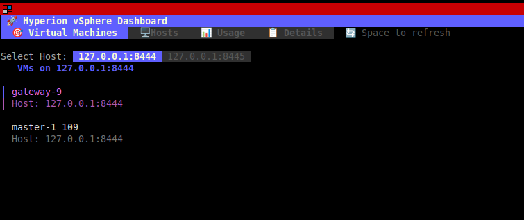

# Hyperion vSphere Dashboard

Hyperion is a terminal-based TUI (Text User Interface) dashboard for monitoring VMware vSphere environments. It provides a live view of virtual machines, ESXi hosts, resource usage, and detailed information.

---

## Features

- List all VMs per host with search/filter
- View VM details (CPU, Memory, Storage, Power state)
- List all ESXi hosts with details (CPU, Memory, VMs, Version, Connection)
- Visual CPU and Memory usage bars per host
- Tab-based interactive TUI with keyboard navigation
- Refresh data on demand

---

## Screenshots



---

## Download

You can download the latest release from the [Releases](https://github.com/yourusername/hyperion/releases) page:

- **Linux:** [hyperion-linux-amd64](https://github.com/yourusername/hyperion/releases/latest/download/hyperion-linux-amd64)  
- **macOS:** [hyperion-darwin-amd64](https://github.com/yourusername/hyperion/releases/latest/download/hyperion-darwin-amd64)  
- **Windows:** [hyperion-windows-amd64.exe](https://github.com/yourusername/hyperion/releases/latest/download/hyperion-windows-amd64.exe)

Make sure to mark it as executable on Linux/macOS:

```bash
chmod +x hyperion-linux-amd64


## Installation

### Prerequisites

- Go 1.21+
- VMware vSphere environment (ESXi hosts accessible via API)

### Clone the repository

```bash
git clone https://github.com/yourusername/hyperion.git
cd hyperion
```

### Build

```bash
go build -o hyperion ./cmd
```

### Run

```bash
./hyperion serve
```

---

## Usage

### Keyboard Shortcuts

| Key             | Action                                   |
|-----------------|-----------------------------------------|
| `tab`           | Switch to next tab                       |
| `shift+tab`     | Switch to previous tab                   |
| `space`         | Refresh data                             |
| `d`             | Show details of selected VM/host         |
| `←` / `→`       | Switch selected host in VM tab           |
| `q` / `esc`     | Quit                                     |

### Tabs Overview

1. **Virtual Machines** - List VMs for selected host, view details  
2. **Hosts** - List ESXi hosts, view details  
3. **Usage** - Show CPU and Memory usage bars per host  
4. **Details** - Display detailed information for VM or host  

---

## Configuration

Hyperion loads configuration from `config/config.yaml`:

```yaml
ESXi:
  - host: "esxi1.example.com"
    user: "root"
    password: "password"
  - host: "esxi2.example.com"
    user: "root"
    password: "password"
```

- `host` – ESXi hostname or IP  
- `user` – Username for ESXi API  
- `password` – Password for ESXi API  

---

## Project Structure

```
cmd/serve.go           # CLI command and program entry
internal/ui/
  model.go             # TUI model and state
  data.go              # Data fetching and refresh logic
  items.go             # List items & delegates
  view.go              # Rendering functions (tabs, bars, footer)
internal/vmware/       # VMware API integration
config/
  config.yaml          # ESXi host configuration
```

---

## Dependencies

- [Bubble Tea](https://github.com/charmbracelet/bubbletea) – TUI framework  
- [Lip Gloss](https://github.com/charmbracelet/lipgloss) – Terminal styling  
- [Bubbles](https://github.com/charmbracelet/bubbles) – TUI components  
- [Cobra](https://github.com/spf13/cobra) – CLI framework  

---

## Contributing

1. Fork the repository  
2. Create a feature branch: `git checkout -b feature/my-feature`  
3. Commit changes: `git commit -m "Add my feature"`  
4. Push branch: `git push origin feature/my-feature`  
5. Open a Pull Request  

---

## License

MIT License. See the [LICENSE](LICENSE) file for details.
